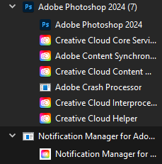

# CCBloatRemover
Run Photoshop or any other Adobe program without the Creative Cloud bloatware running on the background.

## What is Creative Cloud bloatware?
Creative Cloud bloatware refers to the additional software and background processes that are installed alongside the primary Adobe Creative Cloud applications (like Photoshop, Illustrator, Premiere Pro, etc.). These additional components can consume system resources (CPU, memory, disk space) and potentially slow down the performance of the computer. This bloat will be running automatically on the background even when you are not using any of the Adobe programs.



## Instructions
### 1. Stop Creative Cloud from starting on startup
Go to Task Manager, Startup apps and change startup status to "Disabled" for "Creative Cloud.exe", "CCXProcess.exe".

### 2. Disable Adobe Update Service
Go to Services, find a service called "AdobeUpdateService", click properties and change Startup type to "Disabled". If the service is currently running, you can stop it.

### 3. Start the CCBloatRemover.ps1 script
Doing steps 1. and 2. will stop Creative Cloud bloatware running automatically when you start your PC, however it will start again after you run any Adobe program such as Photoshop. To prevent this, run CCBloatRemover.ps1 script on the background to prevent any Creative Cloud related program from starting.

You can do this for example by starting the script automatically on startup. 

1. Download CCBloatRemover.ps1 and put it anywhere on your PC, for example at C:\CCBloatRemover.ps1.
2. Press Windows + R
3. Type "shell:startup" and press Enter
4. Create a file called "CCBloatRemover.bat" and put the following command in it:
	```powershell
	powershell -WindowStyle Hidden -ExecutionPolicy Bypass -File C:\CCBloatRemover.ps1
	```
5. Now the script will automatically start when your PC starts.

### 4. Restart your PC
Restart your PC to stop all the currently running Creative Cloud bloat and to start the script.

### 5. Run Photoshop
You can now start Photoshop or any other Adobe program normally and all the Creative Cloud bloat will be gone.
